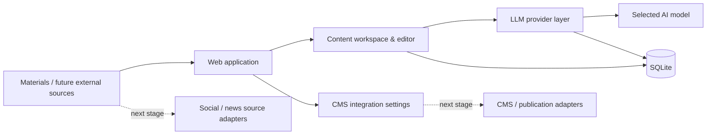

# ContentFlow — AI Content Automation Platform

[Українська](README.md) · [Русский](README.ru.md) · [English](README.en.md)

> **Portfolio case study. Source code and production configuration are intentionally private.**
>
> This repository contains a high-level description of the system, its architecture, implemented functionality, and my role in the project. It does not contain application source code, credentials, or proprietary business data.

## Overview

ContentFlow is an internal AI platform for preparing content and gradually automating the content workflow. It is designed as a unified workspace where materials can be stored, edited, processed through different LLM providers, and prepared for publication through external integrations.

The project grew from a practical business need: reduce repetitive manual operations in content work and build a controlled pipeline that can be expanded with new sources, AI models, and publication channels.

## Business problem

The content workflow involved many disconnected manual steps: preparing material, moving it between services, working with different AI models, editing, storing results, and then transferring the material to a CMS.

Instead of relying on a set of unrelated tools, I designed a single internal system that can evolve into a complete pipeline:

```text
Source / material
       ↓
Collection & filtering
       ↓
LLM processing
       ↓
Editorial review
       ↓
CMS / publication channel
```

Some external source connectors and publishing adapters belong to the next development stage and are not presented here as completed functionality.

## My role

I was responsible for the full solution lifecycle:

- analyzing the business process and identifying what should be automated;
- decomposing the problem and designing the architecture;
- choosing the integration approach for LLM providers and the CMS;
- AI-assisted implementation and work with existing code;
- validating system behavior in a real environment;
- testing, debugging, and iterative development.

## Implemented functionality

The current implementation includes:

- web UI for working with the platform;
- statistics dashboard;
- material list and editing view;
- local data storage in SQLite;
- support for multiple LLM connections;
- custom Base URL and API key configuration for AI providers;
- automatic model discovery through `GET /models`;
- fallback to manual Model ID for providers without a compatible endpoint;
- selection of the active LLM connection and model;
- encrypted API key storage;
- basic CMS integration settings;
- Docker Compose deployment;
- a separate Windows startup workflow.

## Architecture



The architecture intentionally separates content management, LLM providers, data storage, and external integrations so that new sources or models can be added without rebuilding the whole system.

## Technology stack

- **Python**
- **FastAPI**
- **SQLAlchemy / SQLite**
- **REST / HTTP APIs**
- **LLM APIs**
- **Jinja2**
- **Pydantic**
- **Docker / Docker Compose**
- **Windows automation**
- encrypted secrets storage

## Current development direction

The following modules are planned as separate development stages and are not presented as completed features:

- ingestion from external social/news sources;
- automatic structuring and AI processing of materials;
- image import/optimization;
- CMS publishing;
- background jobs, retries, and failure handling;
- Telegram notifications;
- adapters for additional publication channels.

## Result

The project provides a foundation for a complete content automation workflow instead of a fragmented set of manual operations. The implemented part already centralizes work with materials, AI provider configuration, and model selection, while creating a base for future automated ingestion and publication.

## Demo

Screenshots and a short live demonstration can be provided during a technical interview. This public repository intentionally does not contain production source code.

---

### Source code policy

**Source code is private / proprietary.**

This repository is intended only as a portfolio case study. It does not provide access to the implementation, production environment, credentials, internal business data, or reusable proprietary components.
