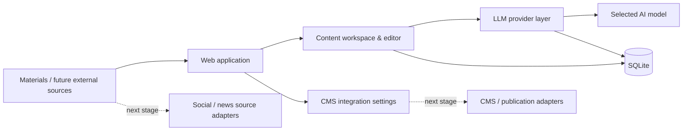

# ContentFlow — AI Content Automation Platform

[Українська](README.md) · [Русский](README.ru.md) · [English](README.en.md)

> **Portfolio case study. Source code and production configuration are intentionally private.**

<p align="center">
  
</p>

## Overview

**ContentFlow** is an internal AI platform for preparing content and gradually automating the content workflow. It brings materials, LLM providers, editorial review, and future publication channels into one controlled workspace.

The project grew from a practical business need: reduce repetitive manual operations and build a pipeline that can be extended with new sources, models, and publication channels without rebuilding the entire system.

| | |
|---|---|
| **Solution type** | Internal tool / AI content automation |
| **My role** | Process analysis, architecture, AI-assisted implementation, testing, iterative development |
| **Backend** | Python, FastAPI, SQLAlchemy, SQLite |
| **Integrations** | REST / HTTP APIs, LLM APIs, CMS settings |
| **Deployment** | Docker Compose + Windows workflow |
| **Status** | Active development / working MVP |

## Business problem

Before the platform was introduced, the content process consisted of many disconnected manual steps: preparing a material, moving it between services, working with different AI models, editing, storing results, and then transferring the material to a CMS.

The goal is to turn that into one controlled workflow:

```text
Source / material
       ↓
Collection & filtering
       ↓
LLM processing
       ↓
Editorial review
       ↓
CMS / publication channel
```

## Product in action

### Content workspace and sources

The platform provides separate working areas for monitoring the content flow, creating materials, managing sources, and preparing publication.

<p align="center">
  
</p>

This is not a mockup. It is the actual working UI of the system: dashboard, material creation flow, source management, and the pipeline through which content moves.

### AI provider layer

LLM connections are handled as a separate layer. OpenAI-compatible providers can be added with a custom Base URL and API key, available models can be discovered through `GET /models`, and an active connection/model can be selected for processing.

<p align="center">
  
</p>

> Confidential credentials are hidden in the public screenshots.

## My role

I was responsible for the full solution lifecycle:

- analyzing the business process and deciding what should be automated;
- decomposing the problem and designing the architecture;
- choosing the integration approach for LLM providers and the CMS;
- AI-assisted implementation and work with existing code;
- validating system behavior in the real environment;
- testing, debugging, and iterative development.

## Implemented

- web UI for working with the platform;
- dashboard with statistics and content-flow state;
- material creation and editing;
- dedicated content-source view;
- local data storage in SQLite;
- support for multiple LLM connections;
- custom Base URL and API key configuration for AI providers;
- automatic model discovery through `GET /models`;
- fallback to a manual Model ID;
- selection of the active LLM connection and model;
- encrypted API key storage;
- basic CMS integration settings;
- Docker Compose deployment;
- a separate Windows startup workflow.

## Architecture



The architecture intentionally separates content management, LLM providers, data storage, and external integrations. This allows new sources or models to be added without rebuilding the entire system.

## Technology stack

`Python` · `FastAPI` · `SQLAlchemy` · `SQLite` · `REST API` · `LLM API` · `Jinja2` · `Pydantic` · `Docker Compose` · `Windows automation`

## Next stages

The following modules are planned as separate development stages and are not presented here as completed functionality:

- ingestion from external social/news sources;
- automatic structuring and AI processing of materials;
- image import / optimization;
- CMS publishing;
- background jobs, retries, and failure handling;
- Telegram notifications;
- adapters for additional publication channels.

## Result

The project provides a foundation for a complete content automation workflow instead of a fragmented collection of manual operations. The implemented part already centralizes work with materials, AI providers, and model configuration while preparing the system for future automated ingestion and publication.

## Demo

During a technical interview I can provide a short live demonstration and discuss the architecture, integrations, implementation choices, and next development stages.

---

### Source code policy

**The source code remains private.**

This repository is intended only as a portfolio case study. It does not provide access to the production environment, credentials, internal business data, or reusable private implementation components.
