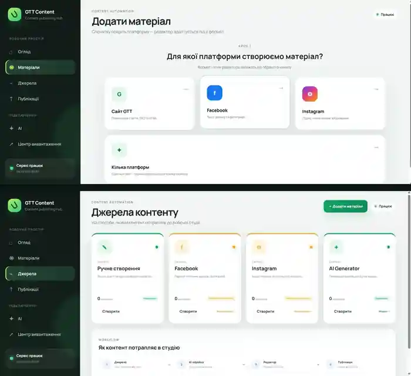
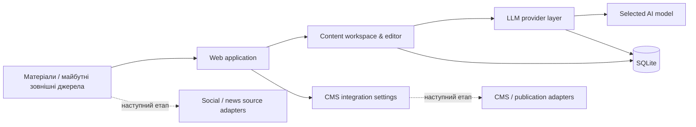

# ContentFlow — AI-платформа автоматизації контенту

[Українська](README.md) · [Русский](README.ru.md) · [English](README.en.md)

> **Портфоліо-кейс. Вихідний код і production-конфігурація навмисно залишаються приватними.**

<p align="center">
  
</p>

## Огляд

**ContentFlow** — внутрішня AI-платформа для підготовки та поступової автоматизації контенту. Вона об'єднує роботу з матеріалами, LLM-провайдерами, редакторською перевіркою та майбутніми каналами публікації в одному робочому середовищі.

Проєкт виріс із практичної бізнес-задачі: скоротити кількість ручних операцій і побудувати керований pipeline, який можна розширювати новими джерелами, моделями та каналами без перебудови всієї системи.

| | |
|---|---|
| **Тип рішення** | Internal tool / AI content automation |
| **Моя роль** | Аналіз процесу, архітектура, AI-assisted implementation, тестування та розвиток |
| **Backend** | Python, FastAPI, SQLAlchemy, SQLite |
| **Інтеграції** | REST / HTTP APIs, LLM APIs, CMS settings |
| **Deployment** | Docker Compose + Windows workflow |
| **Статус** | Активна розробка / робочий MVP |

## Бізнес-проблема

До створення платформи контент-процес складався з багатьох окремих ручних кроків: підготовки матеріалу, перенесення між сервісами, роботи з різними AI-моделями, редагування, збереження результатів і подальшої передачі в CMS.

Ціль — перетворити це на один керований процес:

```text
Джерело / матеріал
       ↓
Збір і фільтрація
       ↓
LLM-обробка
       ↓
Редакторська перевірка
       ↓
CMS / канал публікації
```

## Продукт у роботі

### Контентний workspace і джерела

Платформа має окремі робочі області для огляду контентного потоку, створення матеріалів, керування джерелами та підготовки публікацій.

<p align="center">
  
</p>

Цей інтерфейс показує не макет, а фактичний робочий UI системи: dashboard, створення матеріалу, джерела та логіку проходження матеріалу через pipeline.

### Робота з AI-провайдерами

Підключення LLM винесене в окремий шар. Можна додавати OpenAI-compatible провайдери, налаштовувати Base URL та API key, отримувати список моделей через `GET /models`, обирати активне підключення та модель.

<p align="center">
  
</p>

> На публічних зображеннях конфіденційні облікові дані приховані.

## Моя роль

Я відповідала за повний цикл створення рішення:

- аналіз бізнес-процесу та визначення того, що варто автоматизувати;
- декомпозицію задачі та проєктування архітектури;
- вибір способу інтеграції з LLM-провайдерами та CMS;
- AI-assisted implementation і роботу з існуючим кодом;
- перевірку поведінки системи в реальному середовищі;
- тестування, виправлення помилок та ітеративний розвиток.

## Реалізовано

- web UI для роботи з платформою;
- dashboard зі статистикою та станом контентного потоку;
- створення та редагування матеріалів;
- окреме представлення джерел контенту;
- локальне зберігання даних у SQLite;
- підтримка кількох LLM-підключень;
- custom Base URL та API key для AI-провайдерів;
- автоматичне отримання доступних моделей через `GET /models`;
- fallback із ручним Model ID;
- вибір активного LLM-підключення та моделі;
- шифроване зберігання API-ключів;
- базові налаштування CMS-інтеграції;
- Docker Compose deployment;
- окремий сценарій запуску для Windows.

## Архітектура



Архітектура навмисно розділяє контент, LLM-провайдерів, зберігання даних та зовнішні інтеграції. Це дозволяє додавати нові джерела або моделі без перебудови всієї системи.

## Технології

`Python` · `FastAPI` · `SQLAlchemy` · `SQLite` · `REST API` · `LLM API` · `Jinja2` · `Pydantic` · `Docker Compose` · `Windows automation`

## Наступні етапи

Наступні модулі заплановані як окремі етапи і не подаються тут як уже завершені:

- ingestion із зовнішніх social/news sources;
- автоматична структуризація та AI-обробка матеріалів;
- image import / optimization;
- CMS publishing;
- background jobs, retries та failure handling;
- Telegram notifications;
- adapters для додаткових каналів публікації.

## Результат

Створено основу для повного content automation workflow замість набору розрізнених ручних операцій. Уже реалізована частина централізує роботу з матеріалами, AI-провайдерами та моделями й готує систему до подальшого автоматичного збору та публікації контенту.

## Демонстрація

На технічній співбесіді можу провести коротку live-demo системи та обговорити архітектурні рішення, інтеграції й наступні етапи розвитку.

---

### Політика щодо вихідного коду

**Вихідний код залишається приватним.**

Цей репозиторій призначений лише для демонстрації кейсу в портфоліо. Він не надає доступу до production-середовища, облікових даних, внутрішніх бізнес-даних або повторно використовуваних приватних компонентів.
