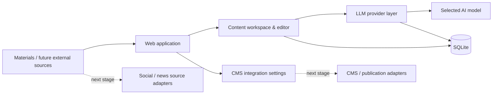

# AI Content Automation Platform — Case Study

> **Portfolio case study. Source code and production configuration are intentionally private.**
>
> This repository contains a high-level description of the system, its architecture, implemented functionality and my role in the project. It does **not** contain application source code, credentials or proprietary business data.

## Overview

Внутрішня AI-платформа для підготовки та подальшої автоматизації контенту. Система створюється як єдине робоче середовище, де матеріали можна зберігати, редагувати, обробляти через різні LLM-провайдери та готувати до подальшої публікації через зовнішні інтеграції.

Проєкт виник із практичної бізнес-задачі: зменшити кількість ручних операцій при роботі з контентом і побудувати керований pipeline, який можна поступово розширювати новими джерелами, AI-моделями та каналами публікації.

## Business problem

Робота з контентом складалася з великої кількості окремих ручних дій: підготовка матеріалу, перенесення між сервісами, робота з різними AI-моделями, редагування, зберігання результатів та подальша передача матеріалу в CMS.

Замість набору розрізнених інструментів була спроєктована єдина внутрішня система, яку можна розвивати до повного pipeline:

```text
Source / material
       ↓
Collection & filtering
       ↓
LLM processing
       ↓
Editorial review
       ↓
CMS / publication channel
```

Частина зовнішніх джерел і publishing-adapters є наступним етапом розвитку платформи; у цьому case study вони не позначаються як завершені функції.

## My role

Я відповідала за повний цикл створення рішення:

- аналіз бізнес-процесу та визначення того, що саме потрібно автоматизувати;
- декомпозицію задачі та проєктування архітектури;
- вибір способу інтеграції з LLM-провайдерами та CMS;
- AI-assisted implementation і роботу з існуючим кодом;
- перевірку поведінки системи в реальному середовищі;
- тестування, виправлення помилок і подальшу ітеративну розробку.

## Implemented functionality

На поточному етапі реалізовано:

- web UI для роботи з платформою;
- dashboard зі статистикою;
- список матеріалів та картка редагування;
- локальне зберігання даних у SQLite;
- підтримку кількох LLM-підключень;
- custom Base URL та API key для AI-провайдерів;
- автоматичне отримання доступних моделей через `GET /models`;
- fallback із ручним Model ID для провайдерів без сумісного endpoint;
- вибір активного LLM-підключення та моделі;
- шифроване зберігання API-ключів;
- базові налаштування інтеграції з CMS;
- запуск через Docker Compose;
- окремий сценарій запуску для Windows.

## Architecture



Архітектура навмисно розділяє роботу з контентом, LLM-провайдерами, зберіганням даних та зовнішніми інтеграціями, щоб нові джерела або моделі можна було додавати без перебудови всієї системи.

## Technology stack

- **Python**
- **FastAPI**
- **SQLAlchemy / SQLite**
- **REST / HTTP APIs**
- **LLM APIs**
- **Jinja2**
- **Pydantic**
- **Docker / Docker Compose**
- **Windows automation**
- encrypted secrets storage

## Current development direction

Наступні модулі заплановані як окремі етапи, а не подаються тут як уже завершені:

- ingestion із зовнішніх social/news sources;
- автоматична структуризація та AI-обробка матеріалів;
- image import/optimization;
- CMS publishing;
- background jobs, retries and failure handling;
- Telegram notifications;
- adapters for additional publication channels.

## Result

Створено базову платформу, на якій можна будувати повний content automation workflow замість набору розрізнених ручних операцій. Уже реалізована частина дозволяє централізовано працювати з матеріалами, конфігурацією AI-провайдерів і моделями та формує основу для подальшого автоматичного збору й публікації контенту.

## Demo

Скріншоти та коротку демонстрацію роботи системи можна надати під час технічної співбесіди. Публічний репозиторій навмисно не містить production source code.

---

### Source code policy

**Source code is private / proprietary.**

This repository is intended only as a portfolio case study. It does not grant access to the implementation, production environment, credentials, internal business data or reusable proprietary components.
