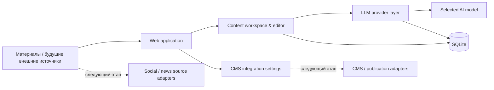

# ContentFlow — AI-платформа автоматизации контента

[Українська](README.md) · [Русский](README.ru.md) · [English](README.en.md)

> **Портфолио-кейс. Исходный код и production-конфигурация намеренно остаются приватными.**

<p align="center">
  
</p>

## Обзор

**ContentFlow** — внутренняя AI-платформа для подготовки и постепенной автоматизации контента. Она объединяет работу с материалами, LLM-провайдерами, редакторской проверкой и будущими каналами публикации в одном рабочем пространстве.

Проект вырос из практической бизнес-задачи: сократить ручные операции и построить управляемый pipeline, который можно расширять новыми источниками, моделями и каналами без перестройки всей системы.

| | |
|---|---|
| **Тип решения** | Internal tool / AI content automation |
| **Моя роль** | Анализ процесса, архитектура, AI-assisted implementation, тестирование и развитие |
| **Backend** | Python, FastAPI, SQLAlchemy, SQLite |
| **Интеграции** | REST / HTTP APIs, LLM APIs, CMS settings |
| **Deployment** | Docker Compose + Windows workflow |
| **Статус** | Активная разработка / рабочий MVP |

## Бизнес-проблема

До создания платформы контент-процесс состоял из множества ручных шагов: подготовки материала, переноса между сервисами, работы с разными AI-моделями, редактирования, хранения результатов и последующей передачи в CMS.

Цель — превратить это в единый управляемый процесс:

```text
Источник / материал
       ↓
Сбор и фильтрация
       ↓
LLM-обработка
       ↓
Редакторская проверка
       ↓
CMS / канал публикации
```

## Продукт в работе

### Контентный workspace и источники

Платформа имеет отдельные рабочие области для обзора контентного потока, создания материалов, управления источниками и подготовки публикаций.

<p align="center">
  
</p>

Это не mockup, а фактический рабочий UI системы: dashboard, создание материала, источники и логика прохождения материала через pipeline.

### Работа с AI-провайдерами

Подключение LLM вынесено в отдельный слой. Можно добавлять OpenAI-compatible провайдеры, настраивать Base URL и API key, получать список моделей через `GET /models`, выбирать активное подключение и модель.

<p align="center">
  
</p>

> На публичных изображениях конфиденциальные учётные данные скрыты.

## Моя роль

Я отвечала за полный цикл создания решения:

- анализ бизнес-процесса и определение того, что стоит автоматизировать;
- декомпозицию задачи и проектирование архитектуры;
- выбор способа интеграции с LLM-провайдерами и CMS;
- AI-assisted implementation и работу с существующим кодом;
- проверку поведения системы в реальном окружении;
- тестирование, исправление ошибок и итеративное развитие.

## Реализовано

- web UI для работы с платформой;
- dashboard со статистикой и состоянием контентного потока;
- создание и редактирование материалов;
- отдельное представление источников контента;
- локальное хранение данных в SQLite;
- поддержка нескольких LLM-подключений;
- custom Base URL и API key для AI-провайдеров;
- автоматическое получение доступных моделей через `GET /models`;
- fallback с ручным Model ID;
- выбор активного LLM-подключения и модели;
- шифрованное хранение API-ключей;
- базовые настройки CMS-интеграции;
- Docker Compose deployment;
- отдельный сценарий запуска для Windows.

## Архитектура



Архитектура намеренно разделяет контент, LLM-провайдеры, хранение данных и внешние интеграции, чтобы новые источники или модели можно было добавлять без перестройки всей системы.

## Технологии

`Python` · `FastAPI` · `SQLAlchemy` · `SQLite` · `REST API` · `LLM API` · `Jinja2` · `Pydantic` · `Docker Compose` · `Windows automation`

## Следующие этапы

Следующие модули запланированы как отдельные этапы и не подаются здесь как уже завершённые:

- ingestion из внешних social/news sources;
- автоматическая структуризация и AI-обработка материалов;
- image import / optimization;
- CMS publishing;
- background jobs, retries и failure handling;
- Telegram notifications;
- adapters для дополнительных каналов публикации.

## Результат

Создана основа для полного content automation workflow вместо набора разрозненных ручных операций. Уже реализованная часть централизует работу с материалами, AI-провайдерами и моделями и подготавливает систему к дальнейшему автоматическому сбору и публикации контента.

## Демонстрация

На техническом собеседовании могу провести короткую live-demo системы и обсудить архитектурные решения, интеграции и следующие этапы развития.

---

### Политика исходного кода

**Исходный код остаётся приватным.**

Этот репозиторий предназначен только для демонстрации кейса в портфолио. Он не предоставляет доступа к production-среде, учётным данным, внутренним бизнес-данным или повторно используемым приватным компонентам.
