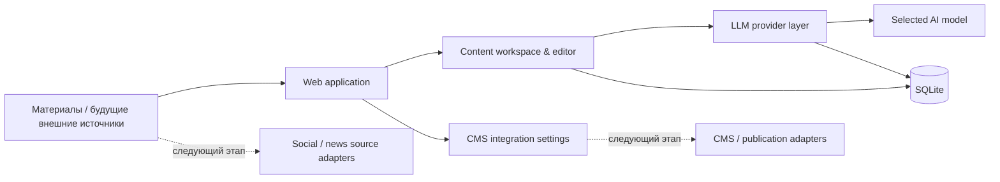

# ContentFlow — AI-платформа автоматизации контента

[Українська](README.md) · [Русский](README.ru.md) · [English](README.en.md)

> **Портфолио-кейс. Исходный код и production-конфигурация намеренно остаются приватными.**
>
> Этот репозиторий содержит высокоуровневое описание системы, её архитектуры, реализованной функциональности и моей роли в проекте. Здесь нет исходного кода приложения, учётных данных или внутренних бизнес-данных.

## Обзор

ContentFlow — внутренняя AI-платформа для подготовки и дальнейшей автоматизации контента. Система создаётся как единая рабочая среда, где материалы можно хранить, редактировать, обрабатывать через разных LLM-провайдеров и готовить к дальнейшей публикации через внешние интеграции.

Проект возник из практической бизнес-задачи: уменьшить количество ручных операций при работе с контентом и построить управляемый pipeline, который можно постепенно расширять новыми источниками, AI-моделями и каналами публикации.

## Бизнес-проблема

Работа с контентом состояла из большого количества отдельных ручных действий: подготовка материала, перенос между сервисами, работа с разными AI-моделями, редактирование, хранение результатов и последующая передача материала в CMS.

Вместо набора разрозненных инструментов была спроектирована единая внутренняя система, которую можно развивать до полного pipeline:

```text
Источник / материал
       ↓
Сбор и фильтрация
       ↓
LLM-обработка
       ↓
Редакторская проверка
       ↓
CMS / канал публикации
```

Часть внешних источников и publishing-adapters относится к следующему этапу развития платформы; в этом кейсе они не обозначаются как завершённые функции.

## Моя роль

Я отвечала за полный цикл создания решения:

- анализ бизнес-процесса и определение того, что именно нужно автоматизировать;
- декомпозицию задачи и проектирование архитектуры;
- выбор способа интеграции с LLM-провайдерами и CMS;
- AI-assisted implementation и работу с существующим кодом;
- проверку поведения системы в реальной среде;
- тестирование, исправление ошибок и дальнейшую итеративную разработку.

## Реализованная функциональность

На текущем этапе реализовано:

- web UI для работы с платформой;
- dashboard со статистикой;
- список материалов и карточка редактирования;
- локальное хранение данных в SQLite;
- поддержка нескольких LLM-подключений;
- custom Base URL и API key для AI-провайдеров;
- автоматическое получение доступных моделей через `GET /models`;
- fallback с ручным Model ID для провайдеров без совместимого endpoint;
- выбор активного LLM-подключения и модели;
- шифрованное хранение API-ключей;
- базовые настройки интеграции с CMS;
- запуск через Docker Compose;
- отдельный сценарий запуска для Windows.

## Архитектура



Архитектура намеренно разделяет работу с контентом, LLM-провайдерами, хранением данных и внешними интеграциями, чтобы новые источники или модели можно было добавлять без перестройки всей системы.

## Технологии

- **Python**
- **FastAPI**
- **SQLAlchemy / SQLite**
- **REST / HTTP APIs**
- **LLM APIs**
- **Jinja2**
- **Pydantic**
- **Docker / Docker Compose**
- **Windows automation**
- шифрованное хранение секретов

## Текущее направление развития

Следующие модули запланированы как отдельные этапы и не подаются здесь как уже завершённые:

- ingestion из внешних social/news sources;
- автоматическая структуризация и AI-обработка материалов;
- image import/optimization;
- CMS publishing;
- background jobs, retries and failure handling;
- Telegram notifications;
- adapters для дополнительных каналов публикации.

## Результат

Создана базовая платформа, на которой можно строить полный content automation workflow вместо набора разрозненных ручных операций. Уже реализованная часть позволяет централизованно работать с материалами, конфигурацией AI-провайдеров и моделями и формирует основу для дальнейшего автоматического сбора и публикации контента.

## Демонстрация

Скриншоты и короткую демонстрацию работы системы можно предоставить во время технического собеседования. Публичный репозиторий намеренно не содержит production source code.

---

### Политика в отношении исходного кода

**Исходный код является приватным / proprietary.**

Этот репозиторий предназначен только для демонстрации кейса в портфолио. Он не предоставляет доступа к реализации, production-среде, учётным данным, внутренней бизнес-информации или повторно используемым proprietary-компонентам.
